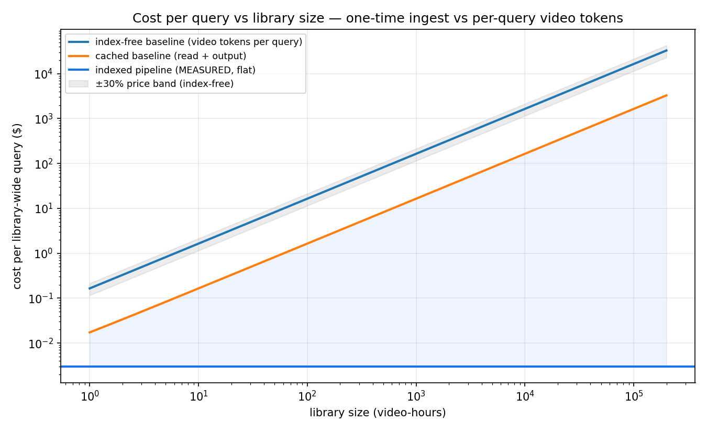
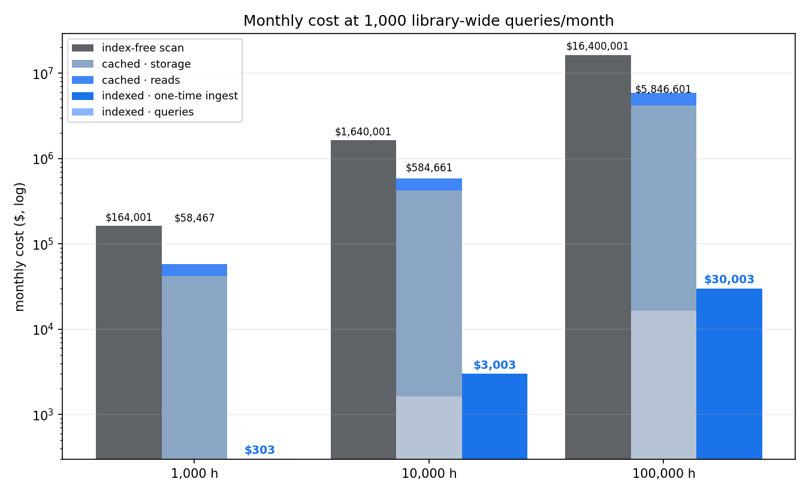
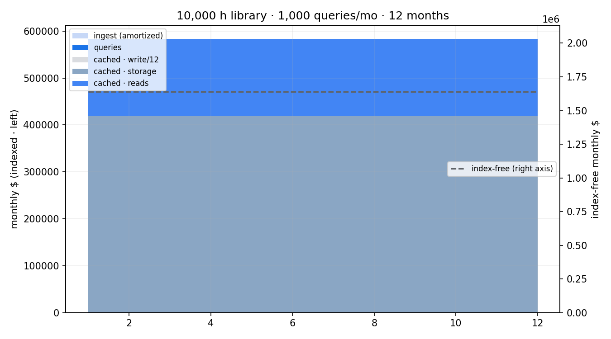
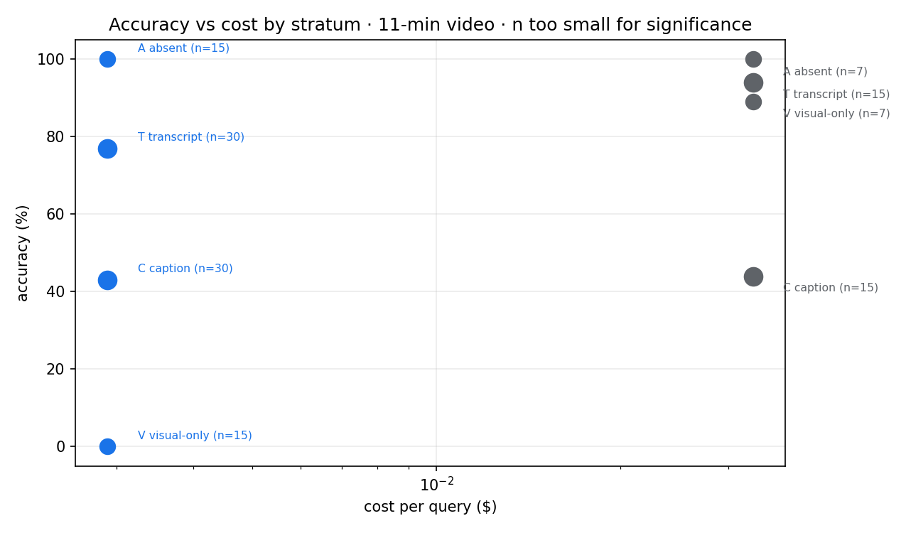

# Indexed vs index-free video QA — cost model at library scale

**TL;DR** — an index-free agentic baseline (whole video to a video-LM, every query) re-bills
~328k media tokens **per video-hour, per query**. An indexed pipeline (one-time ingest →
library-wide retrieval → judged answer with timecodes) pays **~$300 one-time per 1,000 hours**
and **~$0.003 per query flat**. Against a context-cached baseline the marginal gap is ~55×,
but cache **storage is the dominant term** when held continuously — we model it.

Provenance per the house style: every number is labelled **MEASURED** (receipts in
[`receipts/`](receipts/measured-2026-09-17.json)), **INTERPOLATED** (ingest $/video-hour), or
**PROJECTED** (all monthly totals). Vendor prices are list as of **2026-09-17** and will change.

## What was measured (2026-09-17)
- Gemini 3.7/3.8 Flash, agentic-video recipe (1 FPS, low media resolution, thinking high):
  $0.033/query @ 11-min video · $0.067 @ 23-min · $0.206 @ 75-min · ≈328k media tokens per video-hour. **MEASURED**
- Indexed pipeline (search → TypeSafe scene judge → one answer, absolute timecodes):
  $0.0011–0.0044/query, flat vs library size (21-video library test included). **MEASURED**
- One-time ingest: $0.30/video-hour. **INTERPOLATED**

## Headline (1,000 library-wide queries/month, 1,000 h library)
| baseline | monthly | multiplier |
|---|---|---|
| index-free scan | ~$164,000 | — |
| cached (write + storage + reads) | ~$62,000 | ~3× |
| **indexed (agentic.video + Jev)** | **~$303 + one-time $300** | **~544× / ~206×** |

Savings scale linearly with library size; per-query marginal is flat. Break-even vs the
index-free baseline: **~2 queries** recovers the one-time ingest at any library size.

## Honest limits
- Accuracy is **not** the claim: on our public benchmarks Gemini wins overall (78% vs 57%,
  n too small for significance); the indexed pipeline ties on transcript-heavy questions and
  loses visual-only questions structurally (captions can't see). Hybrid routing (index picks
  top-k videos → targeted video-LM) is the mitigation.
- Library-wide queries only — targeted lookups narrow the gap.
- Flat per-query cost measured on one library; no p95 latencies; single content family.

## Charts

Full model, assumptions and sensitivity bands: [`notebook.ipynb`](notebook.ipynb).
